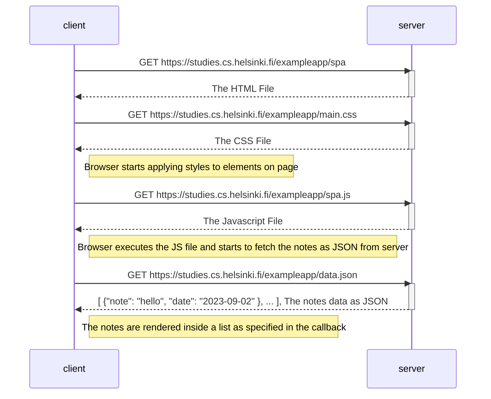

```mermaid
sequenceDiagram
  participant client
  participant server

  client->>server: GET https://studies.cs.helsinki.fi/exampleapp/spa
  activate server
  server-->>client: The HTML File
  deactivate server

  client->>server: GET https://studies.cs.helsinki.fi/exampleapp/main.css
  activate server
  server-->>client: The CSS File
  deactivate server

  Note right of client: Browser starts applying styles to elements on page

  client->>server: GET https://studies.cs.helsinki.fi/exampleapp/spa.js
  activate server
  server-->>client: The Javascript File
  deactivate server

  Note right of client: Browser executes the JS file and starts to fetch the notes as JSON from server

  client->>server: GET https://studies.cs.helsinki.fi/exampleapp/data.json
  activate server
  server-->>client: [ {"note": "hello", "date": "2023-09-02" }, ... ], The notes data as JSON
  deactivate server

  Note right of client: The notes are rendered inside a list as specified in the callback


```